# FUSHTI ## The Best Choice for Your Children

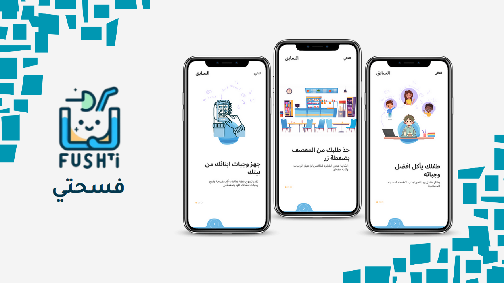

## Problem Definition 📉
Parents face challenges in tracking their children's meals and ensuring they avoid harmful or allergy-inducing foods. There is a need for an app that allows parents to customize meals, restrict harmful foods, and easily manage meal plans to ensure a healthy, balanced diet for their children.

## Goal 🎯
The goal of this project is to provide parents with an intuitive solution for tracking their children's meals, customizing food preferences, and preventing harmful or allergy-inducing foods. The app allows parents to manage meal plans, cater to dietary needs, and ensure a safe, balanced diet for their children.

# Key Features ⚙️

### Parent App Features 👨‍👩‍👧‍👦 
- **Meal Request**: Order meals for children based on available food options.
- **Meal Plan Creation**: Create customized meal plans with specific start and end dates.
- **Open Day**: Allows children to request any meal within a set budget.
- **Barcode Generation**: Parents can generate a barcode for easy and secure meal collection at the cafeteria.
- **Allergies Management**: Add allergies to filter out unsafe food options for the child.
- **Wallet Top-Up**: Add credit to the wallet for meal payments.
- **Order and Invoice History**: View a complete history of meal orders and invoices.
- **Complaint/Suggestion Management**: Parents can submit complaints or suggestions for service improvement.

### Cafeteria App Features 🍽️
- **Add Products**: Cafeteria staff can add new food items to the menu.
- **Edit Products**: Modify existing products as needed.
- **Delete Products**: Remove food items from the menu.
- **Inventory Management**: Manage food stock and track available items.
- **Statistics**: Track statistics related to meal orders, inventory, and other metrics.
- **Barcode Scanning**: Cafeteria staff can scan barcodes to confirm the meal order.
- **View Complaints/Suggestions**: Cafeteria staff can review and act on feedback submitted by parents or users.

## Tools and Technologies 🛠️
- **Dart / Flutter**: For app programming and development.
- **Melos**: To merge one project into two separate apps for parent and cafeteria management.
- **OneSignal**: For push notifications to keep parents and cafeteria staff updated.
- **Moyasar**: For processing payments within the app.
- **Supabase**: For database management and backend services.
- **Figma**: For UI/UX design.

  ## Install
To install and run this project locally, follow these steps:

1. 1. Clone the repository: 
   ```bash
   git clone https://github.com/Basel-75/Graduation-Project.git
2. Navigate to the project customer: 
   ```bash
   cd app/customer

3. Navigate to the project employee: 
   ```bash
   cd app/employee

4. Install dependencies: 
   ```bash
   flutter pub get

5. Install dependencies: 
   ```bash
   melos bs

6. Run the app on an emulator or connected device: 
   ```bash
   flutter run
   
## Screens 📱
Here is a list of the main screens implemented in the project:

### Parent App Screens 👨‍👩‍👧‍👦 

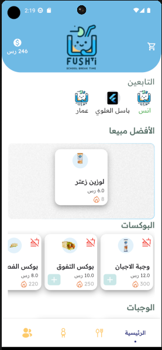

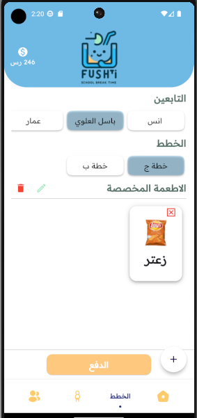
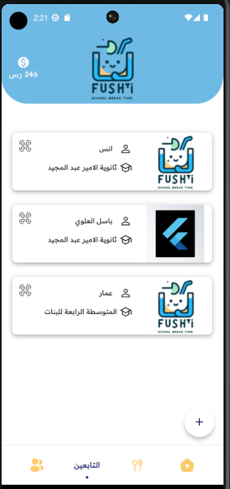
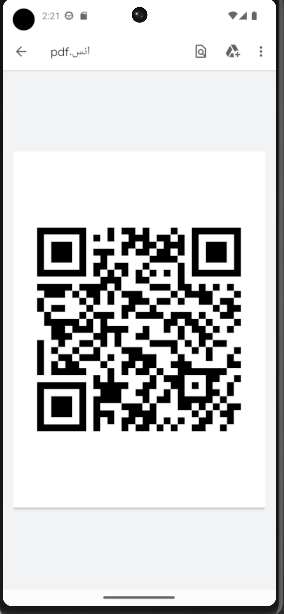
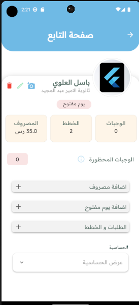
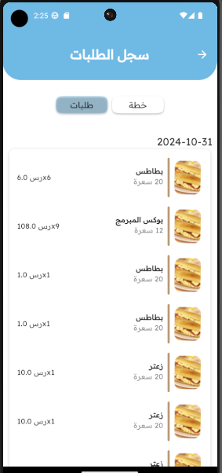
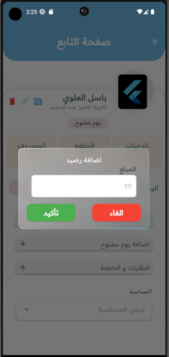
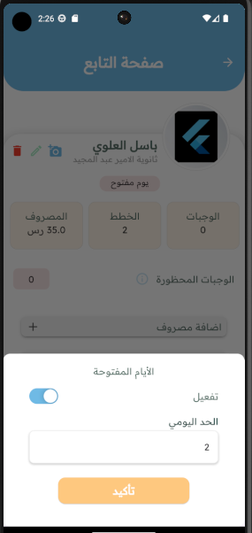
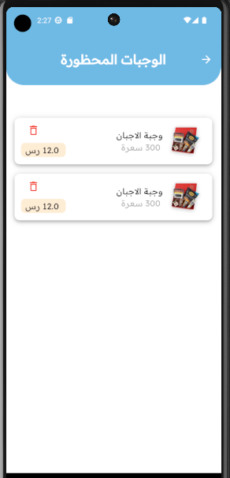
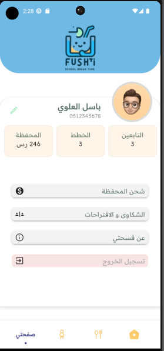
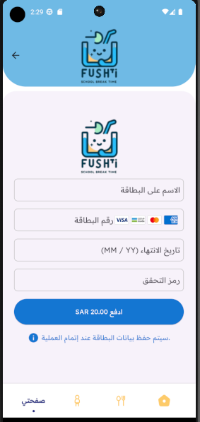
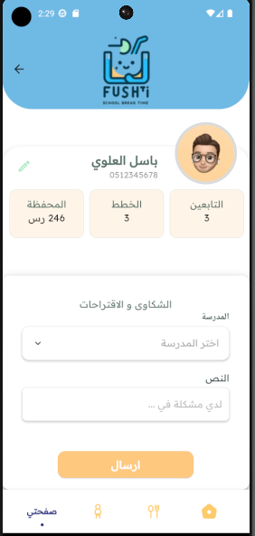
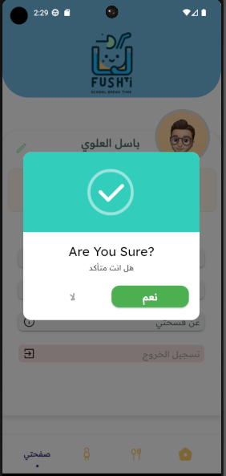
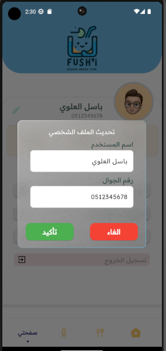
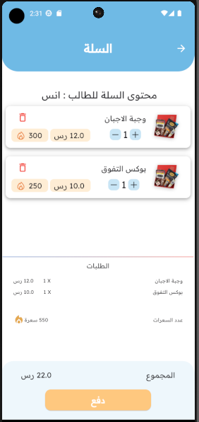
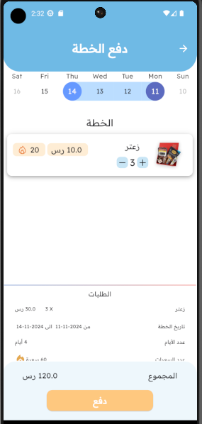
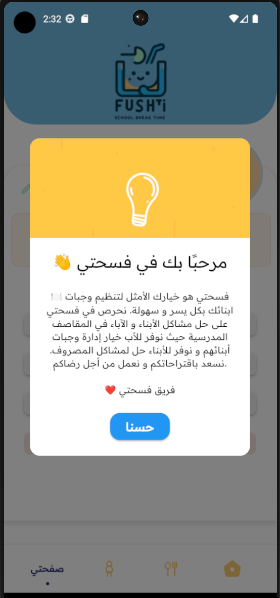

- **Video**:


### Cafeteria App Screens 🍽️ 

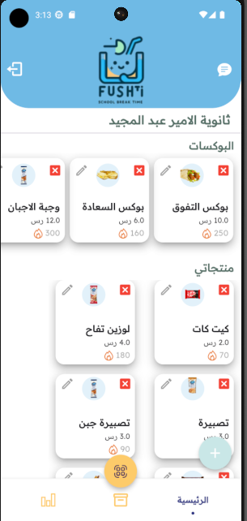
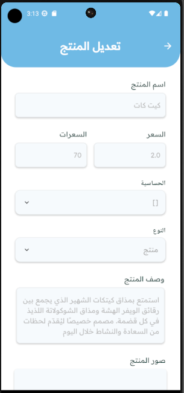
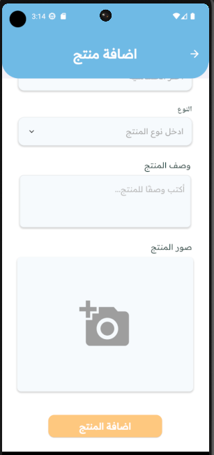
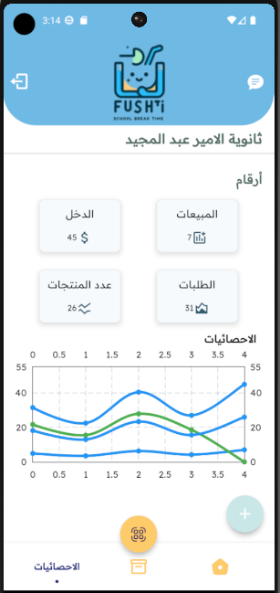
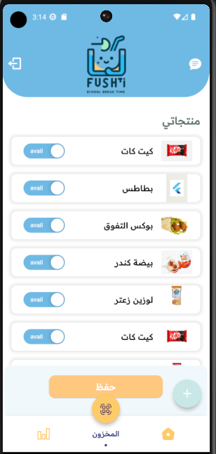

- **Video**:


## Figma File 🎨
You can access the design file here:  
[Figma Design File](https://www.figma.com/design/q8xYGXrPJw1TEFjKJ359Ix/Untitled?node-id=0-1&t=aSr6TUsRh0F9NQuL-1)

## Team Members 👥
This project was developed by the following team members:
- **[Basel](https://github.com/Basel-75)**
- **[Anas Aljuhani](https://github.com/Anas-Aljuhani)**
- **[Ammar](https://github.com/Ammarx9)**

